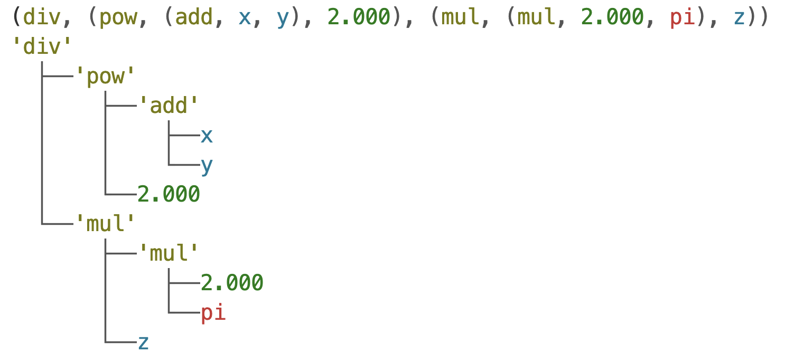

# symgp
Python Symbolic regression with Genetic Programming.

## Overview

`symgp` is a Python library for symbolic regression using genetic programming. It allows users to evolve mathematical expressions to fit given data. The library leverages the power of genetic algorithms to automatically discover mathematical models that best describe the provided data.

## Installation

### Using pip

You can install `symgp` using pip from the GitHub repository:

```sh
pip install git+https://github.com/aledima00/symgp.git
```

### Using Poetry

You can install `symgp` using Poetry from the GitHub repository:

```sh
poetry add git+https://github.com/aledima00/symgp.git
```

### From Source

To install `symgp` from source, clone the repository and install it using Poetry (`poetry` is required):

```sh
git clone https://github.com/aledima00/symgp.git
cd symgp
poetry install
```

## Usage

You can use APIs in different abstraction levels, as each class has its own purpose and it is documented in this repo.
For example, have a look at this tree generation and relative print:

```python
import symgp
from symgp import IndividualTree, Node,Leaf,VarLeaf,SpecialLeaf
from symgp import npf

# we want to represent: ((x+y)^2)/2*pi*z

# create the var leaves
x = VarLeaf("x")
y = VarLeaf("y")
z = VarLeaf("z")

# create the nodes
n1 = Node(npf.add, [x,y])
n2 = Node(npf.pow, [n1,Leaf(2)])
d1 = Node(npf.mul, [Leaf(2),SpecialLeaf("pi")])
d2 = Node(npf.mul, [d1,z])
rt = Node(npf.div, [n2,d2])

# create the individual tree
ind = IndividualTree(rt)

# print the expression
print(ind.fstr())

# print the tree
print(ind.tree_fstr())
```

the associated output is the following

showing both *LISP* and tree representations.

> notice that in all the repo, the `fstr()` and `tree_fstr()` format are used as in this case, and they exploit the `Formatted` class from my `consoleformat` library (https://github.com/aledima00/ConsoleFormat). 

### Basic Example

Here is a basic example of how to use `symgp` to perform symbolic regression:

```python
import numpy as np
from symgp import BaseModel

# Load your data
X = np.random.rand(1, 100)  # Example input data
Y = np.sin(X)  # Example output data

# Define the input variable names
LEAVES_NAMES = [f"x[{i}]" for i in range(X.shape[0])]

# some generation params
generation_params = {
    "int_constants":True, # use int as random constants
    "randc_mean":0, # mean of random constants
    "randc_std":5, # stddev of random constants
    "ctv_prop":0.3, # ratio of constants to input variables
    "stv_prop":0.1, # ratio of special constants (pi,e,...) to normal ones
    "unary_to_others_prop":0.5 # ratio of unary operators to normal ones
}

# Initialize the model
model = BaseModel(
    max_depth=8,
    population_size=1000,
    input_leaves_names=LEAVES_NAMES,
    rand_seed=1234567890,
    generation_params=generation_params
)

# Populate the initial population
model.populate()

# Evolve the population
model.evolve(X,Y, 
    generations=10,
    mutation_rate=0.1,
    elitism_rate=0.02,
    pool_size=2,
    parsimonyweight=0.1,
    parsimony_format='bilinear'
)

# Get the best individual
best_individual = model.population()[0]

# Print the best individual and its fitness
print("Best individual:", best_individual.fstr())
print("Fitness:", best_individual.fitness(X, Y, LEAVES_NAMES))
```

## Library Components

### Core Classes

#### **Operator**

The `Operator` class represents a mathematical operator used in the symbolic expressions. It is basically a wrapper around an actual function that includes some metadata and some addded functionalities.

- **Methods:**
  - `__init__(self, name: str, arity: int, func: Callable, expr: str = None, *, simplify_func: Callable[[List], Tuple['Operator', List]] = None)`: Initializes the operator.
    - `name`: The name of the operator, short for tree and LISP representation.
    - `arity`: The number of arguments the operator takes.
    - `func`: The function implemented and wrapped by the operator.
    - `expr`: The string representation of the operator as to be written in an actual python function; it uses `#N` placeholders to indicate args, like `np.add(#1,#2)`; when not provided, it uses the syntax `np.name(...)`, using the `self.name` parameter and the `self.arity` to write placeholders;
    - `simplify_func`: A function to simplify expressions involving this operator. When called on some params, it returns a tuple with a simplified operator or constant leaf, and eventually children as list of subset of items from input args; it returns `None` when no simplification can be done; for example, to simplify a sum we can apply the function `lambda a,b: mul(2,a) if a==b else None`
  - `__call__(self, *args)`: Applies the operator to the given arguments.
  - `simplified(self, in_lst: List) -> Tuple['Operator', List]`: Simplifies the operator with the given arguments, calling the function provided in initialization to the constructor;
  - `solved_expr(self, args: list) -> str`: Returns the string representation of the operator with the given arguments, replacing the placeholders are substituted with actual data privded by `args`
  - `fstr(self, fstr: Formatted = None) -> Formatted`: Returns a formatted string representation of the operator.
  - `getInfo(self) -> str`: Returns detailed information about the operator.

#### **Node**

The `Node` class represents a node in the symbolic expression tree.
It is a mid-level API, providing a further wrap around operator to use it as a node in a tree representation.

- **Attributes:**
  - `operator`: The operator used in the node.
  - `children`: The list of child nodes.

- **Methods:**
  - `__init__(self, operator: Operator, children: List['Node'])`: Initializes the node.
    - `operator`: The operator used in the node.
    - `children`: The list of child nodes.
  - `simplify(self) -> "Node"`: Simplifies the node.
  - `evaluate(self)`: Evaluates the node.
  - `fstr(self, fstr: Formatted = None) -> Formatted`: Returns a formatted string representation of the node.
  - `tree_fstr(self, depth: int = 0, ended_levels: dict = dict(), fstr: Formatted = None) -> Formatted`: Returns a tree-formatted string representation of the node.
  - `subnodes(self, keep_leaves: bool = True) -> List['Node']`: Returns the subnodes of the node, intended as all the nodes that are not the node itself, and eventually the leaves;
  - `expr(self, names: Dict[str, str] = None) -> str`: Returns the string representation of the node.
    - `names`: The names to use in the string representation.
  - `depth(self) -> int`: Returns the depth of the node.
  - `deepCopy(self) -> "Node"`: Returns a deep copy of the node.

#### **Leaf**

The `Leaf` class represents a leaf node in the symbolic expression tree. It is a class derived from `Node`, reshaped to handle values and no children, being a terminal node.

- **Attributes:**
  - `value`: The value of the leaf.

- **Methods:**
  - `__init__(self, value)`: Initializes the leaf.
    - `value`: The value of the leaf.
  - some other methods are overridden...

#### **VarLeaf**

The `VarLeaf` class represents a variable leaf node in the symbolic expression tree. It is a class derived from `Leaf`, reshaped to handle variable values instead of const ones, assigning values from externally and uniquely identifying const and var instances.

- **Attributes:**
  - `name`: The name of the variable.
  - `assigned`: Whether the variable has been assigned a value.
  - `value`: The value of the variable.

- **Methods:**
  - `__init__(self, name: str)`: Initializes the variable leaf.
    - `name`: The name of the variable.
  - some other methods are overridden...

#### **SpecialLeaf**

The `SpecialLeaf` class represents a special constant leaf node (e.g., π, e) in the symbolic expression tree.
It is derived from the class `Leaf`, implementing basically a special representatio and a creation by string name, using numpy names.

- **Attributes:**
  - `name`: The name of the special constant.
  - `value`: The value of the special constant.

- **Methods:**
  - `__init__(self, name: Literal["pi", "e"])`: Initializes the special leaf.
    - `name`: The name of the special constant.
  - some other methods are overridden...

#### **IndividualTree**

The `IndividualTree` class represents an individual symbolic expression tree.

- **Attributes:**
  - `root`: The root node of the tree.
  - `inputLeaves`: The dictionary of input leaves. It is useful as it needs to be accessed every time a new input is provided to the expression tree.
  - `numInputs`: The number of input leaves.

  Note that last 2 attributes are re-computed at each modification of the tree to keep the structure consistent.

- **Methods:**
  - `__init__(self, root: Node, *, simplify: bool = False)`: Initializes the individual tree.
    - `root`: The root node of the tree.
    - `simplify`: Whether to simplify the tree after creation, useful for randomly-generated trees.
  - `update(self)`: Updates the tree, simplyfying it if possible, and re-computing input leaves.
  - `evaluate_sample(self, kv_inputs: Dict[str, object])`: Evaluates the tree with the given input values.
    - `kv_inputs`: The input values to evaluate the tree with.
  - `tree_fstr(self) -> Formatted`: Returns a tree-formatted string representation of the tree.
  - `fstr(self) -> Formatted`: Returns a formatted string representation of the tree.
  - `evaluate(self, inputs: np.ndarray, order: List[str]) -> np.ndarray`: Evaluates the tree with the given input array.
    - `inputs`: The input array to evaluate the tree with.
    - `order`: The order of the input variables.
  - `mse(self, inputs: np.ndarray, outputs: np.ndarray, order: List[str])`: Computes the mean squared error of the tree.
    - `inputs`: The input array.
    - `outputs`: The output array.
    - `order`: The order of the input variables.
  - `fitness(self, inputs: np.ndarray, outputs: np.ndarray, order: List[str], *, parsimony_weight: float = 0, parsimony_format: Literal["linear", "bilinear"] = "linear")`: Computes the fitness of the tree.
    - `inputs`: The input array.
    - `outputs`: The output array.
    - `order`: The order of the input variables.
    - `parsimony_weight`: The weight of the parsimony penalty.
    - `parsimony_format`: The format of the parsimony penalty.
  - `subnodes(self, keep_leaves: bool = True, keep_root: bool = False) -> List[Node]`: Returns the subnodes of the tree.
    - `keep_leaves`: Whether to keep the leaves in the subnodes.
    - `keep_root`: Whether to keep the root in the subnodes.
  - `getExpr(self, names: Dict[str, str] = None) -> str`: Returns the string representation of the tree.
    - `names`: The names to use in the string representation.
  - `depth(self) -> int`: Returns the depth of the tree.
  - `deepCopy(self) -> "IndividualTree"`: Returns a deep copy of the tree.

### Genetic Operators

#### Recombination: **SubEx**

The `SubEx` class represents the subtree exchange operator used in genetic programming. It is basically the only Recombination Operator used in this framework.
It consists of 2 trees exchanging random sub-trees.

- **Attributes:**
  - `name`: The name of the operator.
  - `rng`: An instance of numpy random number generator.

- **Methods:**
  - `__init__(self, rng: np.random.Generator)`: Initializes the subtree exchange operator.
    - `rng`: The random number generator.
  - `__call__(self, it1: IndividualTree, it2: IndividualTree) -> Tuple[IndividualTree, IndividualTree]`: Applies the subtree exchange operator to two individuals.
    - `it1`: The first individual.
    - `it2`: The second individual.

#### **PointMut**

The `PointMut` class represents the point mutation operator used in genetic programming.
It consists of a change of an operator in a random internal node, choosing the replacing operator from the functional set, respecting the input arity of the former.

- **Attributes:**
  - `name`: The name of the operator.
  - `rng`: The random number generator.

- **Methods:**
  - `__init__(self, rng: np.random.Generator, Fset: List[Node])`: Initializes the point mutation operator.
    - `rng`: The random number generator.
    - `Fset`: The set of functions that can be used in the mutation.
  - `__call__(self, it: IndividualTree) -> IndividualTree`: Applies the point mutation operator to an individual.
    - `it`: The individual to apply the mutation to.

#### **PermMut**

The `PermMut` class represents the permutation mutation operator used in genetic programming.
It consists of a random permutation in the children of a random node.

- **Attributes:**
  - `name`: The name of the operator.
  - `rng`: The random number generator.

- **Methods:**
  - `__init__(self, rng: np.random.Generator)`: Initializes the permutation mutation operator.
    - `rng`: The random number generator.
  - `__call__(self, it: IndividualTree) -> IndividualTree`: Applies the permutation mutation operator to an individual.
    - `it`: The individual to apply the mutation to.

#### **HoistMut**

The `HoistMut` class represents the hoist mutation operator used in genetic programming.
It consists of replacing a random node of the tree with one of its subtree.

- **Attributes:**
  - `name`: The name of the operator.
  - `rng`: The random number generator.

- **Methods:**
  - `__init__(self, rng: np.random.Generator)`: Initializes the hoist mutation operator.
    - `rng`: The random number generator.
  - `__call__(self, it: IndividualTree) -> IndividualTree`: Applies the hoist mutation operator to an individual.
    - `it`: The individual to apply the mutation to.

#### **CollapseMut**

The `CollapseMut` class represents the collapse mutation operator used in genetic programming.
It consists of replacing an internal node of the tree with a random leaf, either an input leaf or a const leaf.

- **Attributes:**
  - `name`: The name of the operator.
  - `rng`: The random number generator.

- **Methods:**
  - `__init__(self, rng: np.random.Generator, input_leaves_names: List[str], lgen_func: Callable)`: Initializes the collapse mutation operator.
    - `rng`: The random number generator.
    - `input_leaves_names`: The list of input leaves names.
    - `lgen_func`: The function to generate leaf nodes.
  - `__call__(self, it: IndividualTree) -> IndividualTree`: Applies the collapse mutation operator to an individual.
    - `it`: The individual to apply the mutation to.

#### **MixedMut**

The `MixedMut` class represents a mixed mutation operator that combines multiple mutation operators.
It is a wrapper around all the other mutation operators, randomly picking them with provided probability, all equal by default.

- **Attributes:**
  - `name`: The name of the operator.
  - `rng`: The random number generator.

- **Methods:**
  - `__init__(self, rng: np.random.Generator, Fset: List[Node], input_leaves_names: List[str], grow_func: Callable, lgen_func: Callable)`: Initializes the mixed mutation operator.
    - `rng`: The random number generator.
    - `Fset`: The set of functions that can be used in the mutation.
    - `input_leaves_names`: The list of input leaves names.
    - `grow_func`: The function to grow new trees.
    - `lgen_func`: The function to generate leaf nodes.
  - `__call__(self, it: IndividualTree) -> IndividualTree`: Applies a randomly chosen mutation operator to an individual.
    - `it`: The individual to apply the mutation to.

### Models

#### **Model**

The `Model` class represents the genetic programming model.

- **Methods:**
  - `__init__(self, max_depth: int, population_size: int, Fset: list[Operator], input_leaves_names: list[str], *, rand_seed: int = _secret_recipe, fitness_grouping_perc: float = None, generation_params: Dict = None)`: Initializes the model.
    - `max_depth`: The maximum depth of the trees.
    - `population_size`: The size of the population.
    - `Fset`: The set of functions that can be used in the trees.
    - `input_leaves_names`: The list of input leaves names.
    - `rand_seed`: The random seed.
    - `fitness_grouping_perc`: The percentage of the population to group by fitness.
    - `generation_params`: The parameters for generating the trees. It is basically a dictionary that can contain some advanced configuration params:
    ```python
      generation_params = {
        "int_constants":True, # use int as random constants
        "randc_mean":0, # mean of random constants
        "randc_std":5, # stddev of random constants
        "ctv_prop":0.3, # ratio of constants to input variables
        "stv_prop":0.1, # ratio of special constants (pi,e,...) to normal ones
        "unary_to_others_prop":0.5 # ratio of unary operators to normal ones
      }
    ```
  - `__grow(self, curr_depth: int = 0) -> IndividualTree`: Grows a new individual tree.
    - `curr_depth`: The current depth of the tree.
  - `__leaf_gen(self) -> Leaf | SpecialLeaf | VarLeaf`: Generates a new leaf node.
  - `populate(self)`: Populates the model with a new generation of individual trees.
  - `kill(self)`: Kills the current population of the model.

#### **BaseModel**

The `BaseModel` is simply a wrapper around the `Model` class, that uses `npf` functions as the input of `Fset` of the model, so that there is no need to indicate manually all the operators.

### npf

The `npf` module provides a set of predefined operators and functions that can be used to build symbolic expressions. These operators are wrappers around common NumPy functions, allowing for seamless integration with the `symgp` library.

All the operators can be accessed under the scope `npf`, under `symgp`.

These operators can be used to construct complex mathematical expressions within the genetic programming framework provided by `symgp`.

#### Example Usage

Here is an example of how to use the `npf` operators to create a symbolic expression:

```python
from symgp import Node, Leaf, VarLeaf
from symgp import npf

# Create variable leaves
x = VarLeaf("x")
y = VarLeaf("y")

# Create nodes using npf operators
n1 = Node(npf.add, [x, y])
n2 = Node(npf.pow, [n1, Leaf(2)])
n3 = Node(npf.sin, [n2])

# Print the expression
print(n3.fstr())
```

## License And Notices
This project is licensed under the Apache License 2.0. Please see the [LICENSE](LICENSE) file for the full text.

Additional attribution notices for third-party libraries are provided in the [NOTICE.md](NOTICE.md) file.